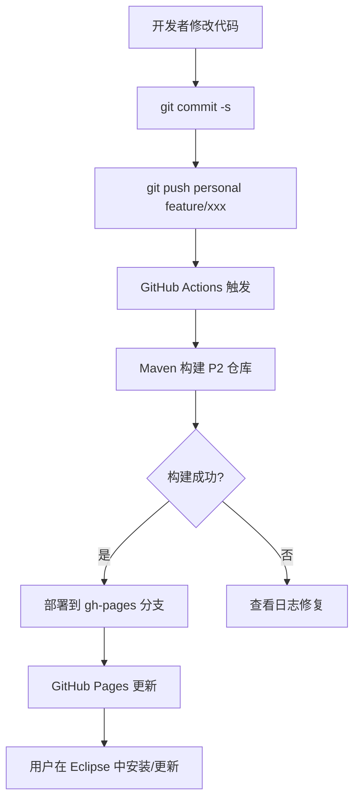

# RuyiSDK Eclipse 插件自动更新功能实现文档

## 项目概述

**实现日期**：2025年10月20日  
**目标**：新增-为 RuyiSDK Eclipse 插件建立基于 GitHub Pages 的自动更新机制，使用户能够方便地安装和更新插件

---

## 实现目标

### 核心需求
1. **自动化构建**：每次代码提交自动触发 Maven 构建（之前实现）

2. **自动化部署**：构建成功后自动发布到 GitHub Page

   

3. **在线更新**：用户通过 Eclipse IDE 的更新站点安装和更新插件

   

4. **版本管理**：提供版本更新脚本，简化版本发布流程--暂时没用到，考虑的是用户自己用脚本

5. **Feature 分支开发**：支持在 feature 分支直接测试--任意提交都会触发

### 技术选型
- **构建工具**：Maven + Tycho (Eclipse 插件专用构建工具)
- **CI/CD**：GitHub Actions
- **托管平台**：GitHub Pages (免费 P2 更新站点托管)
- **更新协议**：Eclipse P2 (Provisioning Platform)--待继续学习

---

## 新增文件及作用

### 1. GitHub Actions Workflows

#### `.github/workflows/build-and-publish-p2.yml`
**作用**：自动构建和发布 P2 更新站点

**触发条件**：
- 推送到任何分支（支持 feature 分支开发）
- 修改 `plugins/`、`features/`、`pom.xml` 或 workflow 文件
- 手动触发（workflow_dispatch）

**主要步骤**：
```yaml
1. Checkout 代码
2. 设置 JDK 21
3. Maven 构建 P2 仓库 (mvn clean verify)
4. 准备 P2 站点文件
5. 生成 index.html 索引页
6. 部署到 gh-pages 分支
7. 上传构建产物（保留 30 天）
```


**关键优化**：

```yaml
# 支持任何分支触发（不限于 main）--因为考虑到main应该作为为保护分支
on:
  push:
    paths:
      - 'plugins/**'
      - 'features/**'
      - 'pom.xml'
      - '.github/workflows/**'

# 任何推送都部署（支持 feature 分支测试）
if: github.event_name == 'push'
```

#### `.github/workflows/release.yml`
**作用**：创建正式版本发布

**触发条件**：
- 推送版本标签（如 `v0.0.5`）
- 手动触发

**主要步骤**：
```yaml
1. 获取版本号（从 tag 或手动输入）
2. 构建 P2 仓库
3. 打包为 zip 和 tar.gz
4. 生成 Release Notes（包含安装说明）
5. 创建 GitHub Release
6. 附加下载文件
```

**使用方式**：
```bash
git tag v0.0.5
git push origin v0.0.5
```

---

### 2. Maven 构建配置

#### `.gitignore`
**作用**：防止构建产物、IDE 配置、临时文件被提交到仓库

**关键内容**：
```gitignore
# Maven 构建产物
target/
*.jar
*.war
*.ear

# Eclipse IDE 配置
.settings/
.metadata
.project
.classpath

# 包文件（保留 lib/ 中的依赖）
!lib/*.jar
```

**重要性**：
- 保持仓库整洁
- 减小仓库大小
- 避免平台差异导致的冲突

#### 根目录 `pom.xml`
**作用**：Maven 父项目配置，统一管理所有子模块

**关键配置**：
```xml
<version>0.0.4-SNAPSHOT</version>
<packaging>pom</packaging>

<modules>
  <module>plugins/org.ruyisdk.core</module>
  <module>plugins/org.ruyisdk.devices</module>
  <!-- ... 其他插件 ... -->
  <module>features/org.ruyisdk.feature</module>
  <module>repository</module>
</modules>

<!-- Tycho 插件配置 -->
<build>
  <plugins>
    <plugin>
      <groupId>org.eclipse.tycho</groupId>
      <artifactId>tycho-maven-plugin</artifactId>
      <version>4.0.10</version>
      <extensions>true</extensions>
    </plugin>
  </plugins>
</build>
```

#### `repository/pom.xml`
**作用**：P2 更新站点构建配置

**功能**：
- 聚合所有插件和 feature
- 生成 P2 元数据（artifacts.xml, content.xml）
- 打包为可部署的更新站点

#### `repository/category.xml`
**作用**：定义 P2 更新站点的分类和显示信息

```xml
<site>
  <description name="RuyiSDK IDE Update Site">
    Update site for RuyiSDK Eclipse IDE plugins
  </description>
  
  <feature url="features/org.ruyisdk.feature_0.0.4.qualifier.jar" 
           id="org.ruyisdk.feature" 
           version="0.0.4.qualifier">
    <category name="ruyisdk"/>
  </feature>
  
  <category-def name="ruyisdk" label="RuyiSDK IDE">
    <description>
      RuyiSDK Eclipse IDE plugins for RISC-V development.
    </description>
  </category-def>
</site>
```

#### `repository/p2.inf`
**作用**：P2 元数据增强配置

```properties
# 时间戳（由 Maven 自动填充）
properties.0.name = p2.timestamp
properties.0.value = ${maven.build.timestamp}

# 启用压缩
properties.1.name = p2.compressed
properties.1.value = true

# 镜像 URL（用于更新站点）
properties.2.name = p2.mirrorsURL
properties.2.value = https://exceed-zk.github.io/ruyisdk-eclipse-plugins/
```

#### `features/org.ruyisdk.feature/feature.xml`
**作用**：Eclipse Feature 定义，包含所有插件

**重要性**：
- Maven 构建**必需**此文件
- 定义 feature 的版本、许可证、包含的插件
- 缺少会导致构建失败

#### 各插件的 `pom.xml`
**作用**：每个插件的 Maven 配置

**示例**：
```xml
<parent>
  <groupId>org.ruyisdk</groupId>
  <artifactId>parent</artifactId>
  <version>0.0.4-SNAPSHOT</version>
  <relativePath>../../pom.xml</relativePath>
</parent>

<artifactId>org.ruyisdk.core</artifactId>
<packaging>eclipse-plugin</packaging>
```

#### 各插件的 `build.properties`
**作用**：定义哪些文件需要打包到插件中

**示例**：
```properties
source.. = src/
output.. = bin/
bin.includes = META-INF/,\
               .,\
               plugin.xml,\
               icons/
```

---

### 3. 版本管理工具

#### `update-version.ps1` (Windows PowerShell)
**作用**：自动更新所有文件中的版本号

**使用方式**：
```powershell
.\update-version.ps1 0.0.5
```

**更新的文件**：
- 根 `pom.xml`
- `features/org.ruyisdk.feature/feature.xml`
- `repository/category.xml`
- 所有插件的 `META-INF/MANIFEST.MF`
- 所有模块的 `pom.xml`

**版本格式**：
- Maven：`0.0.5-SNAPSHOT`
- OSGi：`0.0.5.qualifier`

#### `update-version.sh` (Linux/macOS Bash)
**作用**：同上，用于 Linux/macOS 系统

**使用方式**：
```bash
chmod +x update-version.sh
./update-version.sh 0.0.5
```

---

## 遇到的问题及解决方案

### 问题 1：缺少 feature.xml 导致构建失败

**错误信息**：
```
Could not read feature descriptor at 
/home/runner/work/.../features/org.ruyisdk.feature/feature.xml 
(No such file or directory)
```

**原因**：
- Maven Tycho 需要 `feature.xml` 来构建 Eclipse Feature
- 从其他提交提取配置时遗漏了此文件

**解决方案**：
```bash
git checkout a6318e0 -- features/org.ruyisdk.feature/feature.xml
git add features/org.ruyisdk.feature/feature.xml
git commit --amend
```

**反思**：Eclipse Feature 构建的核心文件不能缺失

---

### 问题 2：版本号不匹配--因为之前修改忘记改回来了

**错误信息**：
```
Unqualified OSGi version 1.0.0.qualifier must match 
unqualified Maven version 0.0.4-SNAPSHOT for SNAPSHOT builds
```

**原因**：
- `MANIFEST.MF` 中的 `Bundle-Version` 和 `pom.xml` 中的 `version` 不一致
- Tycho 要求两者的主版本号必须相同

**不一致的插件**：
- intro: `1.0.0.qualifier` vs `0.0.4-SNAPSHOT`
- news: `1.0.0.qualifier` vs `0.0.4-SNAPSHOT`
- packages: `1.0.0` (缺少 `.qualifier`) vs `0.0.4-SNAPSHOT`
- projectcreator: `1.0.0.qualifier` vs `0.0.4-SNAPSHOT`
- ruyi: `0.0.5.qualifier` vs `0.0.4-SNAPSHOT`
- ui: `1.0.0.qualifier` vs `0.0.4-SNAPSHOT`

**解决方案**：
统一所有插件的版本号为 `0.0.4.qualifier`

```bash
# 批量修改 MANIFEST.MF
sed -i 's/Bundle-Version: 1.0.0.qualifier/Bundle-Version: 0.0.4.qualifier/' \
  plugins/*/META-INF/MANIFEST.MF
```

**版本号规则**：
- Maven: `<major>.<minor>.<patch>-SNAPSHOT`
- OSGi: `<major>.<minor>.<patch>.qualifier`
- 主版本号（前三位）必须一致
- `qualifier` 会被 Tycho 替换为时间戳

---

### 问题 3：依赖解析失败

**错误信息**：
```
Missing requirement: org.ruyisdk.packages 0.0.4.qualifier requires 
'osgi.bundle; org.glassfish.javax.json 1.1.4' but it could not be found
```

**原因**：
- packages 插件在 `MANIFEST.MF` 中声明了对外部 bundle `org.glassfish.javax.json` 的依赖
- 但实际上该 jar 已经包含在插件的 `lib/` 目录中
- 不应该再声明外部依赖

**解决方案**：
从 `MANIFEST.MF` 中移除外部依赖声明：

```diff
Require-Bundle: 
  org.eclipse.ui,
  ...
  org.ruyisdk.core,
- org.ruyisdk.ruyi,
- org.glassfish.javax.json;bundle-version="1.1.4"
+ org.ruyisdk.ruyi
Bundle-ClassPath: ., lib/javax.json-1.1.4.jar
```

**原理**：
- `Bundle-ClassPath` 指定了类路径，包括 `lib/javax.json-1.1.4.jar`
- 不需要通过 `Require-Bundle` 引入
- 使用本地 jar 更可靠，不依赖目标平台提供

---

### 问题 4：GitHub Pages 显示 README 而非 P2 站点

**现象**：
访问 `https://exceed-zk.github.io/ruyisdk-eclipse-plugins/` 显示项目 README，而不是 P2 更新站点的 index.html

**原因**：
- GitHub Pages 优先显示 `README.md` 而非 `index.html`
- `gh-pages` 分支中同时包含了 README 和 P2 站点文件

**解决方案**：
换了分支，要重新deploy跑一遍工作流


**验证**：
- 重新访问更新站点 URL 应该看到 P2 安装说明

  

---

### 问题 5：应该遵守main 分支受保护无法直接推送

**场景**：
源仓库的 main 分支设置了保护规则，要求 PR 审核，但开发测试需要频繁迭代

**解决方案**：
修改 workflow 支持 feature 分支直接部署

**修改前**：
```yaml
on:
  push:
    branches: [ main, master ]  # 只在 main 分支触发

- name: Deploy to GitHub Pages
  if: github.event_name == 'push' && github.ref == 'refs/heads/main'
```

**修改后**：
```yaml
on:
  push:
    # 移除分支限制，任何分支都能触发
    paths:
      - 'plugins/**'
      - 'features/**'
      - 'pom.xml'
      - '.github/workflows/**'

- name: Deploy to GitHub Pages
  # 任何推送都部署
  if: github.event_name == 'push'
```

**优点**：
- feature 分支可以独立开发测试
- 不需要合并到 main 就能验证功能
- 不受分支保护规则限制

**注意事项**：
- 所有分支共享同一个 GitHub Pages
- 最后推送的分支会覆盖 Pages 内容
- 建议：个人开发用 fork 仓库测试

---

## 工作流程

### 完整的开发到部署流程



### 详细步骤

#### 1. 本地开发

```bash
# 切换到 feature 分支
git checkout feature/add-auto-update-documentation

# 修改代码
vim plugins/org.ruyisdk.core/src/...

# 提交（使用 DCO 签名）
git add .
git commit -s -m "feat: add new feature"
```

#### 2. 推送触发构建

```bash
# 推送到个人 fork 仓库
git push personal feature/add-auto-update-documentation
```

#### 3. GitHub Actions 自动执行

1. **Checkout 代码**
   ```yaml
   - uses: actions/checkout@v4
   ```

2. **设置 JDK 21**
   ```yaml
   - uses: actions/setup-java@v4
     with:
       java-version: '21'
       distribution: 'temurin'
   ```

3. **Maven 构建**
   
   ```yaml
   - run: mvn clean verify
   ```
   - 编译所有插件
   - 运行测试
   - 生成 P2 仓库
   - 输出到 `repository/target/repository/`
   
4. **准备 P2 站点**
   ```yaml
   - run: |
       mkdir -p p2-site
       cp -r repository/target/repository/* p2-site/
       cat > p2-site/index.html << 'EOF' ...
   ```

5. **部署到 GitHub Pages**
   ```yaml
   - uses: peaceiris/actions-gh-pages@v3
     with:
       publish_dir: ./p2-site
       publish_branch: gh-pages
   ```

#### 4. 验证部署

访问：`https://exceed-zk.github.io/ruyisdk-eclipse-plugins/`

应该看到：
- P2 更新站点首页
- 安装说明
- 检查更新方法

验证 P2 元数据：
- `https://exceed-zk.github.io/ruyisdk-eclipse-plugins/artifacts.xml`
- `https://exceed-zk.github.io/ruyisdk-eclipse-plugins/content.xml`

#### 5. Eclipse 中测试

1. 打开 Eclipse IDE

2. `Help` → `Install New Software...`

3. 点击 `Add...`

4. 输入：
   - Name: `RuyiSDK Plugins`
   - Location: `https://exceed-zk.github.io/ruyisdk-eclipse-plugins/`

5. 选择 `RuyiSDK IDE` 并安装

6. 重启 Eclipse

7. 验证插件功能

   

   由于没有上传新版本（目前来看是成功了）--可能要重新测试
   

---

## 核心原理--待补充

### Eclipse P2 更新机制

**P2 (Provisioning Platform)** 是 Eclipse 的插件安装和更新框架。

#### P2 仓库结构

```
p2-repository/
├── artifacts.xml         # 或 artifacts.jar (压缩版)
├── content.xml          # 或 content.jar (压缩版)
├── features/
│   └── org.ruyisdk.feature_0.0.4.xxxxxxxx.jar
└── plugins/
    ├── org.ruyisdk.core_0.0.4.xxxxxxxx.jar
    ├── org.ruyisdk.devices_0.0.4.xxxxxxxx.jar
    └── ...
```

**artifacts.xml**：
- 描述仓库中的所有工件（jar 文件）
- 包含文件大小、MD5、下载 URL 等信息

**content.xml**：
- 描述插件和 feature 的元数据
- 包含依赖关系、版本信息、能力声明

**工作流程**：
1. Eclipse 读取 `artifacts.xml` 和 `content.xml`
2. 解析可用的插件和 feature
3. 计算依赖关系
4. 下载需要的 jar 文件
5. 安装到 Eclipse

---

### Tycho 构建原理

**Tycho** 是 Maven 的插件，专门用于构建 Eclipse 插件。

#### 关键特性

1. **理解 OSGi 元数据**
   - 读取 `MANIFEST.MF`
   - 解析 `Bundle-SymbolicName`、`Bundle-Version`、`Require-Bundle`

2. **目标平台解析**
   - 下载 Eclipse 平台的依赖
   - 解析插件之间的依赖关系

3. **版本管理**
   - 统一 Maven 版本和 OSGi 版本
   - `qualifier` 替换为构建时间戳

4. **P2 仓库生成**
   - 根据 `category.xml` 生成分类
   - 生成 `artifacts.xml` 和 `content.xml`

#### Tycho 插件配置

```xml
<plugin>
  <groupId>org.eclipse.tycho</groupId>
  <artifactId>tycho-maven-plugin</artifactId>
  <version>4.0.10</version>
  <extensions>true</extensions>
</plugin>

<plugin>
  <groupId>org.eclipse.tycho</groupId>
  <artifactId>target-platform-configuration</artifactId>
  <configuration>
    <target>
      <artifact>
        <groupId>org.eclipse</groupId>
        <artifactId>eclipse-target</artifactId>
        <version>2024-12</version>
      </artifact>
    </target>
  </configuration>
</plugin>
```

---

### GitHub Actions + GitHub Pages 部署

#### GitHub Actions

**优势**：
- 与 GitHub 集成，配置简单
- 每月 2000 分钟免费额度（公开仓库无限）
- 支持 Ubuntu、Windows、macOS

**核心概念**：
- **Workflow**：自动化流程定义（YAML 文件）
- **Job**：一组相关的 step
- **Step**：具体的操作（命令或 Action）
- **Action**：可复用的操作单元

#### GitHub Pages--方便

**特性**：
- 免费静态网站托管
- 支持自定义域名
- 自动 HTTPS
- 与仓库集成

**部署方式**：
1. 从分支部署（推荐 `gh-pages`）
2. 从 Actions 工件部署（新方式）

**本项目使用**：
- peaceiris/actions-gh-pages@v3 Action
- 自动管理 `gh-pages` 分支
- `force_orphan: true` 确保分支干净

---

## 测试与验证

### 构建测试

#### 本地测试
```bash
# 完整构建
mvn clean verify

# 快速构建（跳过测试）
mvn clean verify -DskipTests

# 只构建特定模块
mvn clean verify -pl plugins/org.ruyisdk.core
```

#### CI 测试
- 推送代码自动触发
- 查看 Actions 日志
- 检查构建产物

### 部署验证

#### 1. 检查 gh-pages 分支
```bash
git fetch personal gh-pages
git checkout gh-pages
ls -la
```

应该看到：
- `index.html`
- `artifacts.jar` / `artifacts.xml`
- `content.jar` / `content.xml`
- `features/` 目录
- `plugins/` 目录

#### 2. 验证 P2 元数据

访问并下载：
```bash
curl -I https://exceed-zk.github.io/ruyisdk-eclipse-plugins/artifacts.xml
curl -I https://exceed-zk.github.io/ruyisdk-eclipse-plugins/content.xml
```

状态码应为 200。

#### 3. Eclipse 安装测试

**首次安装**：
1. 添加更新站点 URL
2. 应该能看到 "RuyiSDK IDE" feature
3. 安装并重启
4. 验证插件功能

**更新测试**：
1. 发布新版本（修改版本号并推送）
2. Eclipse 中 `Help` → `Check for Updates`
3. 应该能检测到新版本
4. 安装更新并重启
5. 验证新功能

---

## 版本发布流程

### 标准发布流程

#### 1. 更新版本号

使用自动化脚本：

**Windows**:
```powershell
.\update-version.ps1 0.0.5
```

**Linux/macOS**:
```bash
./update-version.sh 0.0.5
```

或手动更新：
- `pom.xml` → `0.0.5-SNAPSHOT`
- `feature.xml` → `0.0.5.qualifier`
- `category.xml` → `0.0.5.qualifier`
- 所有 `MANIFEST.MF` → `0.0.5.qualifier`

#### 2. 本地测试构建

```bash
mvn clean verify
```

确保无错误。

#### 3. 提交版本更新

```bash
git add .
git commit -s -m "chore: bump version to 0.0.5"
git push personal feature/add-auto-update-documentation
```

#### 4. 验证 Actions 构建

访问 Actions 页面，确认构建成功。

#### 5. 在 Eclipse 中测试

添加更新站点并测试安装。

#### 6. 创建 Release Tag

```bash
git tag v0.0.5 -m "Release version 0.0.5"
git push personal v0.0.5
```

#### 7. 查看 GitHub Release

`release.yml` workflow 会自动：
- 创建 Release
- 生成 Release Notes
- 附加下载文件（zip 和 tar.gz）

---

## 最佳实践

### 开发建议

#### 1. 分支管理

```
main 分支
  ├── 保持与源仓库同步
  └── 受保护，不直接推送

feature/xxx 分支
  ├── 功能开发
  ├── 自动部署测试
  └── 完成后创建 PR 到源仓库

gh-pages 分支
  ├── 由 Actions 自动管理
  └── 不要手动修改
```

#### 2. 提交规范

使用 Conventional Commits：

```bash
feat: 新功能
fix: Bug 修复
```

示例：
```bash
git commit -s -m "feat(core): add device auto-discovery"
git commit -s -m "fix(packages): resolve dependency conflict"
```

#### 3. 版本号规则--初步认识

**语义化版本（Semantic Versioning）**：

```
<major>.<minor>.<patch>[-qualifier]

major: 不兼容的 API 变更
minor: 向后兼容的功能新增
patch: 向后兼容的 Bug 修复
qualifier: 预发布标识（SNAPSHOT、qualifier）
```

**示例**：
- `0.0.4-SNAPSHOT` → 开发版本
- `0.0.4.qualifier` → 构建时替换为时间戳
- `1.0.0` → 正式版本

#### 4. 依赖管理

**原则**：
- 优先使用 Eclipse 平台提供的依赖
- 必需的第三方库放在 `lib/` 目录
- 在 `Bundle-ClassPath` 中声明

**示例**：
```manifest
Bundle-ClassPath: .,
 lib/gson-2.12.1.jar,
 lib/json-20250107.jar
```

不要通过 `Require-Bundle` 引入非标准的 OSGi bundle。

#### 5. CI/CD 优化

**触发条件优化**：
```yaml
paths:
  - 'plugins/**'
  - 'features/**'
  - 'pom.xml'
  - '.github/workflows/**'
```

只在相关文件变更时触发，节省 CI 资源。

**缓存优化**：
```yaml
- uses: actions/setup-java@v4
  with:
    cache: 'maven'
```

缓存 Maven 依赖，加快构建速度。

**并行构建**：
```yaml
strategy:
  matrix:
    os: [ubuntu-latest, windows-latest, macos-latest]
```

多平台并行测试（如果需要）。

---

## 故障排查

### 常见问题及解决

#### 1. 构建失败：找不到依赖

**错误**：
```
Could not resolve dependency: org.eclipse.xxx
```

**解决**：
检查 `pom.xml` 中的目标平台配置：
```xml
<target>
  <artifact>
    <groupId>org.eclipse</groupId>
    <artifactId>eclipse-target</artifactId>
    <version>2024-12</version>
  </artifact>
</target>
```

#### 2. Eclipse 安装失败

**错误**：
```
Cannot complete the install because of a conflicting dependency
```

**原因**：
- 插件版本与 Eclipse 版本不兼容
- 缺少必需的依赖插件

**解决**：
检查 `MANIFEST.MF` 中的 `Require-Bundle` 和 Eclipse 版本要求。

#### 3. GitHub Pages 404

**问题**：更新站点 URL 返回 404

**检查**：
1. GitHub Pages 是否已启用
2. `gh-pages` 分支是否存在
3. 分支配置是否正确

**解决**：
```bash
# 检查 gh-pages 分支
git ls-remote personal gh-pages

# 手动触发 Actions
git commit --allow-empty -m "Trigger deployment"
git push
```

#### 4. Actions 权限错误

**错误**：
```
Resource not accessible by integration
```

**解决**：
在仓库 Settings → Actions → General：
- Workflow permissions → Read and write permissions
- 勾选 "Allow GitHub Actions to create and approve pull requests"

---

## 参考资源

### 官方文档（都是官方说明文档）

- [Eclipse Tycho](https://eclipse.dev/tycho/)
- [Eclipse P2](https://help.eclipse.org/latest/topic/org.eclipse.platform.doc.isv/guide/p2_publisher.html)
- [GitHub Actions](https://docs.github.com/en/actions)
- [GitHub Pages](https://docs.github.com/en/pages)

### 示例项目

- [Eclipse EPP Packages](https://github.com/eclipse-packaging/packages)
- [M2Eclipse](https://github.com/eclipse-m2e/m2e-core)

### 工具

- [Tycho Version Bump Plugin](https://github.com/eclipse/tycho/tree/master/tycho-versions-plugin)
- [P2 Director](https://help.eclipse.org/latest/topic/org.eclipse.platform.doc.user/tasks/running_eclipse.htm)

---

## 总结

### 实现成果

✅ **自动化构建**：每次提交自动构建 P2 仓库  
✅ **自动化部署**：构建成功自动发布到 GitHub Pages  
✅ **在线更新**：用户可通过 Eclipse 安装和更新  
✅ **版本管理**：提供自动化脚本简化发布流程  
✅ **Feature 分支开发**：不依赖 main 分支，快速迭代测试

### 技术亮点

1. **完整的 CI/CD 流程**
   - GitHub Actions 自动化
   - Maven + Tycho 构建
   - GitHub Pages 托管

2. **灵活的开发模式**
   - 支持 feature 分支部署
   - 不受 main 分支保护限制
   - 多人协作友好

3. **规范的版本管理**
   - 自动化版本更新脚本
   - 统一 Maven 和 OSGi 版本
   - 语义化版本控制

4. **解决实际问题**
   - 克服 main 分支保护限制
   - 提供快速测试反馈
   - 降低部署门槛

### 实际价值

**对开发者**：
- 提交代码即可测试，无需手动构建
- 快速验证功能，缩短开发周期
- 自动化流程减少人为错误

**对用户**：
- 方便安装和更新插件
- 总是能获取最新版本
- 标准的 Eclipse 更新体验

**对项目**：
- 降低发布成本
- 提高发布频率
- 保证发布质量

---

## 附录

### A. 完整文件清单

```
ruyisdk-eclipse-plugins/
├── .github/
│   └── workflows/
│       ├── build-and-publish-p2.yml    # 构建和发布 workflow
│       └── release.yml                 # Release workflow
├── .gitignore                          # Git 忽略文件
├── pom.xml                            # Maven 父项目
├── update-version.ps1                 # 版本更新脚本（Windows）
├── update-version.sh                  # 版本更新脚本（Linux/macOS）
├── features/
│   └── org.ruyisdk.feature/
│       ├── feature.xml                # Feature 定义
│       ├── feature.properties         # Feature 属性
│       ├── build.properties           # 构建配置
│       └── pom.xml                    # Maven 配置
├── plugins/
│   ├── org.ruyisdk.core/
│   │   ├── META-INF/MANIFEST.MF      # OSGi 元数据
│   │   ├── build.properties          # 构建配置
│   │   └── pom.xml                   # Maven 配置
│   ├── org.ruyisdk.devices/
│   ├── org.ruyisdk.intro/
│   ├── org.ruyisdk.news/
│   ├── org.ruyisdk.packages/
│   ├── org.ruyisdk.projectcreator/
│   ├── org.ruyisdk.ruyi/
│   └── org.ruyisdk.ui/
└── repository/
    ├── category.xml                   # P2 分类定义
    ├── p2.inf                         # P2 元数据配置
    └── pom.xml                        # P2 仓库构建配置
```

### B. 关键命令速查

```bash
# 构建
mvn clean verify

# 更新版本
.\update-version.ps1 0.0.5

# 提交（DCO签名）
git commit -s -m "feat: xxx"

# 推送触发部署
git push personal feature/xxx

# 创建 Release
git tag v0.0.5
git push personal v0.0.5

# 同步源仓库
git fetch origin main
git merge origin/main
```

### C. 重要 URL

- **更新站点**：`https://exceed-zk.github.io/ruyisdk-eclipse-plugins/`
- **GitHub 仓库**：`https://github.com/exceed-zk/ruyisdk-eclipse-plugins`
- **Actions 页面**：`https://github.com/exceed-zk/ruyisdk-eclipse-plugins/actions`
- **Releases 页面**：`https://github.com/exceed-zk/ruyisdk-eclipse-plugins/releases`

---

**文档版本**：1.0  
**最后更新**：2025-10-20  
**作者**：exceed-zk  

